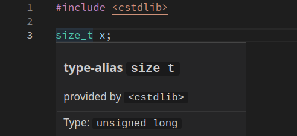
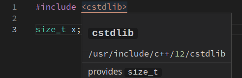
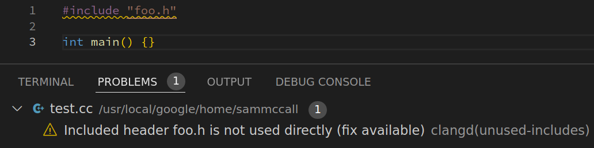
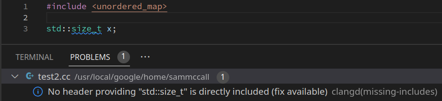

# Managing `#include`s

clangd has features to help you maintain the set of `#include`
directives at the top of each file that are used to import dependencies.

It follows the [include-what-you-use](https://github.com/include-what-you-use/include-what-you-use/blob/master/docs/WhyIWYU.md)
model: **each source file should `#include` headers that declare the symbols
 it references, and no others.**

This means:
 - files should not rely on _transitive_ includes, only headers they include
   directly
 - `#include` directives describe direct dependencies between files, and it's
   possible to reason about them locally

This is opinionated, and stricter than "will it compile". It implies adding
`#includes` that the compiler does not strictly need. Some `#includes` that
satisfy the compiler should be replaced with more specific ones.
If your codebase broadly aims to follow this style, you should enable these
features.

## Show which headers are used

{:.v16}

Hovering on a name will show you which header provides that symbol:


Hovering on an `#include` will show which of its symbols are used in the file.


Using "find references" in your editor you can navigate to these uses.

## "Unused include" warning

{:.v14}

`#include`ing headers that are not used can confuse readers, slow down build
times, and make code harder to refactor. clangd can warn about this:



Often, these `#include` directives have no effect and can simply be removed.
This isn't always the case: the analysis makes assumptions about code style.

## "Missing include" warning

{:.v16}

Similarly, using symbols from a header without `#include`ing it is brittle and
hides dependencies. clangd can show such uses:



Generally clangd can suggest a correct `#include` to add here. In some
cases where multiple headers provide a symbol, you may prefer a different one.

## Scenarios and solutions

**An included header X is marked unused, but it #includes Y, which I use**

**clangd says I should include header Y, but I'm already including X, which
includes Y**

This is a transitive include. Generally you should avoid this, but there are
times when it's needed, especially with external libraries.

- Remove the `#include "X.h"` and add `#include "Y.h"` 
- If X **intends** to provide all the symbols of Y, indicate this in `X.h` with:
  `#include "Y.h" // IWYU pragma: export`
- If X is an internal header that should not be included directly, add a comment
  `// IWYU pragma: private; include "Y.h"`.
- Suppress unused-include warnings with `// IWYU pragma: keep`.
- Suppress all warnings for `X.h` in your configuration.

**A header is marked unusued, but is needed by other headers I later include**

The later headers are not self-contained; our idea of dependencies breaks down.

- Suppress the warning with `// IWYU pragma: keep`. Document why!
- Suppress all warnings for this header in your configuration.

**I'm editing header X and `#include "Y.h"` is marked unused. I want X to
provide all of Y's symbols**

You are exporting a header: this makes dependencies less clear and
coarser-grained, but is sometimes useful.

- Indicate this with `#include "Y.h" // IWYU pragma: export`.
- If Y is a private implementation detail, annotate it with
  `// IWYU pragma: private: include "X.h"`.

**I'm using a symbol in a tricky way (e.g. through a template), but the header
is marked as unused**

There are some types of uses the analysis cannot find.

- Suppress the warning with `// IWYU pragma: keep`

**A header is marked unused, but removing it breaks my build!**

clangd's definition of "unused" isn't the same as the compiler's (see above
section). You may have to add missing includes too, or do other cleanups.

- Identify which headers are **directly** used, and `#include` those instead.
- Suppress the warning with `// IWYU pragma: keep`.

**clangd suggests `#include "X"`, but the real header for the symbol is Y.**

This is merely a suggestion: including `Y` should also hide the warning.

clangd tries to pick the best header, preferring those that public,
self-contained, provide full definitions (for classes and templates), and have
a name matching the symbol's name.

However, there are limitations. Most notably: only headers that are already
transitively included are considered. You may have to insert the correct
#include yourself.

**clangd suggests `#include <cstddef>`, but we prefer e.g. `<stddef.h>`**

If the file is C++, then the C++ headers `<c*>` will be preferred.
The C header names `<*.h>` will still be accepted as providing the symbol, but
you'll have to `#include` them by hand - this behavior isn't customizable.

If you're using namespaced symbols (`std::printf` rather than `::printf`) then
only the `<cstdio>` header is acceptable.

## Adjusting behavior

### Configuration

In your configuration file, set `Diagnostics.UnusedIncludes` and
`Diagnostics.MissingIncludes` to `Strict` or `None`.
You can also disable analysis of particular files (using `If` blocks),
and suppress all warnings of certain headers.

```
If:
  PathMatch: .*/project1/.*\.cpp
Diagnostics:
  UnusedIncludes: Strict
  MissingIncludes: Strict
  Includes:
    IgnoreHeader: Python\.h
```

### IWYU pragmas

These are magic comments [compatible with the include-what-you-use tool](
https://github.com/include-what-you-use/include-what-you-use/blob/master/docs/IWYUPragmas.md).
clangd supports only a subset.

* **keep**

  ```
  #include "secretly-used.h" // IWYU pragma: keep
  ```

  This avoids a particular `#include` being marked unused, without saying why.

* **export**

  ```
  // in "foo.h"
  #include "secretly-used.h" // IWYU pragma: export
  ```

  Files can include `foo.h` to use symbols declared in `secretly-used.h`.
  The exported `#include` line itself will never be marked as unused.

* **private**

  ```
  // in "private.h"
  // IWYU pragma: private; include "public.h"
  ```

  Files **must** include `public.h` to use symbols defined in `private.h`.
