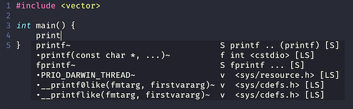

# Getting started

To use clangd, you need:
 - clangd installed
 - a plugin for your editor
 - to tell clangd how your project is built

## Installing clangd

You'll want a **recent** version of clangd. The current release is 10.0.

After installing, `clangd --version` should print `clangd version 7.0.0` or later.

(Version numbers are based on LLVM. clangd 7 was the first usable release).

### Installling with a package manager

<details>
<summary markdown="span">Mac OS X</summary>
Clangd can be installed (along with LLVM) via [Homebrew](https://brew.sh):
```
brew install llvm
```
</details>

<details>
<summary markdown="span">Windows</summary>
Download the LLVM installer from [releases.llvm.org](http://releases.llvm.org/download.html)
</details>

<details>
<summary markdown="span">Debian/Ubuntu</summary>
Installing the `clangd` package will usually give you a slightly older version.

Try to install the latest packaged release (9.0):
```
sudo apt-get install clangd-9
```
If that's not found, at least `clangd-9` or `clangd-8` should be available.
Versions before 8 were part of the `clang-tools` pacakge.

This will install clangd as `/usr/bin/clangd-9`. Make it the default `clangd`:
```
sudo update-alternatives --install /usr/bin/clangd clangd /usr/bin/clangd-9 100
```
</details>

<details>
<summary markdown="span">Other systems</summary>
Most distributions include clangd in a `clangd` package, in a `clang-tools`
package, or in the full `llvm` distribution.

For some platforms, binaries are also avaliable at [releases.llvm.org](http://releases.llvm.org/download.html).
</details>

### Standalone .zip releases

You can also download binaries directly for macOS, windows, and Linux (x86-64):
[latest stable release](https://github.com/clangd/clangd/releases/latest).

If you live on the bleeding edge, snapshot pre-releases are built weekly and
available on the [github releases page](https://github.com/clangd/clangd/releases).

## Editor plugins

Language Server plugins are available for many editors. In principle clangd
should work with any of them, though feature set and interface may vary.

Here are some plugins we know work well with clangd:

<details>
<summary markdown="span">Vim/Neovim</summary>
We recommend to use [coc.nvim](https://github.com/neoclide/coc.nvim) + [coc-clangd](https://github.com/clangd/coc-clangd)
in Vim/Neovim.

1. install [Node.js](https://nodejs.org/), both `coc.nvim` and `coc-clangd` run on Node.js.
2. install `coc.nvim` by [vim-plug](https://github.com/junegunn/vim-plug)
(check out [coc.nvim Wiki](https://github.com/neoclide/coc.nvim/wiki/Install-coc.nvim) for other options):
   - add `Plug 'neoclide/coc.nvim', {'branch': 'release'}` to `.vimrc/init.vim`
   - run `:PlugInstall` in Vim
3. in Vim, run `:CocInstall coc-clangd`
4. `coc-clangd` will try to find clangd from your $PATH, if not found, you can
run `:CocCommand clangd.install` to install the [latest release](https://github.com/clangd/clangd/releases) from GitHub
5. follow [Project setup](#project-setup) to generate `compile_commands.json` for your project

You should see completions and diagnostics as you type.



`coc.nvim` + `coc-clangd` has excellent support for all `clangd` features, including:

 - code completions
 - diagnostics and fixes
 - find declarations, references, and definitions
 - find symbol in file or workspace
 - hover and highlights, you can use [jackguo380/vim-lsp-cxx-highlight](https://github.com/jackguo380/vim-lsp-cxx-highlight)
 for additional semantic highlighting
 - code actions

`clangd` supports some [extensions](/extensions.html) that are not in the official
[Language Server Protocol specification](https://microsoft.github.io/language-server-protocol/specification).
`coc-clangd` adds support for:

 - Switching between header and implementation file: `:CocCommand clangd.switchSourceHeader`
 - File status monitor, shows on statusline
 - Describe symbol under the cursor: `:CocCommand clangd.symbolInfo`
 - Completions that adjust text near the cursor (e.g. correcting `.` to `->`)

---

You can also use [YouCompleteMe](https://github.com/ycm-core/YouCompleteMe) or
[LanguageClient-neovim](https://github.com/autozimu/LanguageClient-neovim/wiki/Clangd) with `clangd`.
</details>

<details>
<summary markdown="span">Emacs</summary>
[eglot](https://github.com/joaotavora/eglot) can be configured to work with clangd.

Install eglot with `M-x package-install RET eglot RET`.

Add the following to `~/.emacs` to enable clangd:

```
(require 'eglot)
(add-to-list 'eglot-server-programs '((c++-mode c-mode) "clangd"))
(add-hook 'c-mode-hook 'eglot-ensure)
(add-hook 'c++-mode-hook 'eglot-ensure)
```

After restarting you should see diagnostics for errors in your code, and `M-x
completion-at-point` should work.


eglot supports many of clangd's features, with caveats:
 - code completion, though the interaction is quite poor (even with
   `company-mode`, see below)
 - diagnostics and fixes
 - find definitions and references (`M-x xref-find-definitions` etc)
 - hover and highlights
 - code actions (`M-x eglot-code-actions`)

### company-mode

eglot does have basic integration with company-mode, which provides a more
fluent completion UI.

You can install it with `M-x package-install RET company RET`, and enable it
with `M-x company-mode`.

**company-clang is enabled by default**, and will interfere with clangd.
Disable it in `M-x customize-variable RET company-backends RET`.

Completion still has some major limitations:
 - completions are alphabetically sorted, not ranked.
 - only pure-prefix completions are shown - no fuzzy matches.
 - completion triggering seems to be a bit hit-and-miss.


### Under the hood

- **Debug logs**: available in the `EGLOT stderr` buffer.
- **Command-line flags and alternate binary**: instead of adding `"clangd"`
  to `eglot-server-programs`, add `("/path/to/clangd" "-log=verbose")` etc.
</details>

<details>
<summary markdown="span">Visual Studio Code</summary>
The official extension is 
[vscode-clangd](https://marketplace.visualstudio.com/items?itemName=llvm-vs-code-extensions.vscode-clangd)
and can be installed from within VSCode.

Choose **View** --> **Extensions**, then search for "clangd". (Make sure
the Microsoft C/C++ extension is **not** installed).

After restarting, you should see red underlines underneath errors, and
you should get rich code completions including e.g. function parameters.


vscode-clangd has excellent support for all clangd features, including:
 - code completion
 - diagnostics and fixes
 - find declarations, references, and definitions
 - find symbol in file (`Ctrl-P @foo`) or workspace (`Ctrl-P #foo`)
 - hover and highlights
 - code actions

### Under the hood

- **Debug logs**: when clangd is running, you should see "Clang Language Server"
  in the dropdown of the Output panel (**View** -> **Output**).
- **Command-line flags**: these can be passed in the `clangd.arguments` array
  in your `settings.json`. (**File** -> **Preferences** -> **Settings**).
- **Alternate clangd binary**: set the `clangd.path` string in `settings.json`.
</details>

<details>
<summary markdown="span">Sublime Text</summary>
[tomv564/LSP](https://github.com/tomv564/LSP) works with clangd out of the box.

Select **Tools**-->**Install Package Control** (if you haven't installed it yet).

Press `Ctrl-Shift-P` and select **Package Control: Install Package**. Select
**LSP**.

Press `Ctrl-Shift-P` and select **LSP: Enable Language Server Globally**. Select
**clangd**.

Open a C++ file, and you should see diagnostics and completion:


The LSP package has excellent support for all most clangd features, including:
 - code completion (a bit noisy due to how snippets are presented)
 - diagnostics and fixes
 - find definition and references
 - hover and highlights
 - code actions

### Under the hood

Settings can be tweaked under **Preferences**-->**Package Settings**-->**LSP**.

- **Debug logs**: add `"log_stderr": true`
- **Command-line flags and alternate clangd binary**: inside the
  `"clients": {"clangd": { ... } }` section, add
  `"command": ["/path/to/clangd", "-log=verbose"]` etc.

</details>

<details>
<summary markdown="span">Other editors</summary>
There is a directory of LSP clients at [langserver.org](http://langserver.org).

A generic client should be configured to run the command `clangd`, and
communicate via the language server protocol on standard input/output.
</details>

If you don't have strong feelings about an editor, we suggest you try out
[VSCode](https://code.visualstudio.com/), it has excellent language server
support and most faithfully demonstrates what clangd can do.

## Project setup

To understand your source code, clangd needs to know your build flags.
(This is just a fact of life in C++, source files are not self-contained).

By default, clangd will assume your code is built as `clang some_file.cc`,
and you'll probably get spurious errors about missing `#include`d files, etc.
There are a couple of ways to fix this.

### `compile_commands.json`

This file provides compile commands for every source file in a project.
It is usually generated by tools.
Clangd will look in the parent directories of the files you edit looking for it.

<details>
<summary markdown="span">CMake-based projects</summary>
If your project builds with CMake, it can generate this file. You should enable
it with:

```cmake -DCMAKE_EXPORT_COMPILE_COMMANDS=1```

`compile_commands.json` will be written to your build directory.
You should symlink it (or simply copy it) to the root of your source tree, if
they are different.

```ln -s ~/myproject/compile_commands.json ~/myproject-build/```
</details>

<details>
<summary markdown="span">Other build systems, using Bear</summary>
[Bear](https://github.com/rizsotto/Bear) is a tool to generate a
compile_commands.json file by recording a complete build.

For a `make`-based build, you can run `make clean; bear make` to generate the
file (and run a clean build!).
</details>

Other tools can also generate this file. See [the compile_commands.json
specification](https://clang.llvm.org/docs/JSONCompilationDatabase.html).

### `compile_flags.txt`

If all files in a project use the same build flags, you can put those
flags one-per-line in `compile_flags.txt` in your source root.

Clangd will assume the compile command is `clang $FLAGS some_file.cc`.

Creating this file by hand is a reasonable place to start if your project is
quite simple.
