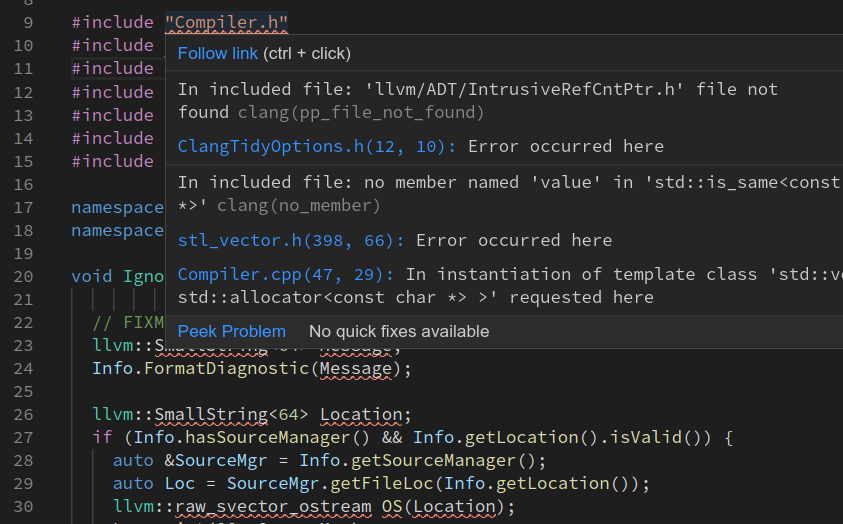

# Troubleshooting

Sorry if things are going wrong!



## Update clangd

Every release fixes many bugs, works in more scenarios, and provides clearer
logs for troubleshooting.

Try to [install the latest major-version release][installation] or even a
pre-release snapshot before you try anything else!

## Gathering logs

Your editor should make clangd's `stderr` log available (see [installation][]
for how). These describe the messages exchanged between the editor and `clangd`,
and what clangd was thinking.

Even if you don't understand the contents, it's tremendously useful to include
this when filing a bug. If you add `--log=verbose` to the clangd arguments, this
will include more detail (e.g. the full content of LSP messages).

## Lots of error diagnostics

If your code builds OK but clangd shows lots of error diagnostics, it
probably can't parse your code very well. Other features will work poorly too:



### Can't find includes within your project

This usually means that we don't have a compile command for this file.
`compile_commands.json` should exist in some parent directory and should have
a valid command. If this file has changed, you'll need to restart clangd to see
the changes.

The logs can tell you whether `compile_commands.json` was found and what compile
command was ultimately used.

### Can't find standard library headers (`<map>`, `<stdio.h>` etc)

First, you'll need the standard library (and any other libraries you depend on)
installed on your system! Even if you don't actually build on this machine,
clangd needs to parse the headers.

The standard library headers are often found relative to the compiler.
Try to configure your project with an absolute path to the compiler
(`/usr/bin/gcc`, not `gcc`).
The logs (with `--log=verbose`) can tell you the `cc1` command, including which
paths were searched for the standard library. You can compare this to the output
of `clang -### <args>`.

If you're using an unusual compiler (e.g. a cross-compiler for a different
platform) you may want to pass `--query-driver=/path/to/mygcc` or
`--query-driver=/path/to/mygcc,/path/to/myg++` when using C++ to allow clangd
to extract the include paths from it directly.

### Can't find compiler built-in headers (`<stddef.h>` etc)

These headers are formally part of the standard library, but so closely coupled
to the parser that they are installed with clangd.

They must be found in `../lib/clang/<version>/include`. If you've built clangd
from source or installed it from a package, these should be in the right place.
If you've moved the binary around, move it back!

## Dealing with crashes

If clangd is exiting unexpectedly, this is probably a crashing bug in clangd.
Understanding it better will help you work around it, and if you can file an
informative [bug report][] we'll try to fix it for the next release.

The most helpful crash reports have a log including a (symbolic) stack trace,
some idea of what the trigger is, and fairly compact example code that exhibits
the problem.

### Crashes triggered by requests

If clangd crashes when you go to a particular definition, or hover on a
particular name, then the bug is probably in the code handling that request.
You can sometimes just avoid doing this!

If you can, try to work out the simplest program that will still exhibit the
crash. This is a much more useful/fixable bug report.

### Crashes when opening a file

If clangd triggers as soon as you open a particular file, it's likely a crash
when parsing or indexing that file (or an included header). Again it's very
useful to know what's in the file and minimize it as far as possible (especially
include).

A crash goes that goes away when disabling clang-tidy (`--clang-tidy=0`) is
likely specific to a particular check and pattern of code.

Note that a background-indexing crash can appear to trigger on file open.

### Crashes in background indexing

Unfortunately a crash while background-indexing any file can take down the whole
clangd process. When you start clangd again, it will pick up where it left off,
and crash again. You can tell that this is happening if adding the clangd flag
`--background-index=0` avoids the crash.

Typically many files are indexed at once and it can be hard to tell which is
crashing. Pass `-j=1 --log=verbose` to clangd to only index one file at a time
and log its name. Once the file is identified, it can also be reduced to a
simpler crashing example.

### Getting stacktraces from crashes

`clangd` is likely writing a "stack trace" to the logs which helps explain
why it crashed. It may look unhelpful, like this:

```
/home/me/bin/clangd[0x4f626c]
/lib/x86_64-linux-gnu/libpthread.so.0(+0x13520)[0x7fb6b93c3520]
/home/me/bin/clangd[0x12cc8d2]
...
```

It will be more useful if you have `llvm-symbolizer` on your PATH.

```
0x00000000004f626c llvm::sys::RunSignalHandlers()
0x00007fe04358f520 __restore_rt
0x00000000012cc8d2 clang::Parser::ParseDirectDeclarator()
...
```

This is typically part of the `llvm` package.
It may be installed as e.g. `llvm-symbolizer-10`, and you need to add a symlink.

[installation]: /installation
[bug report]: https://github.com/clangd/clangd/issues
